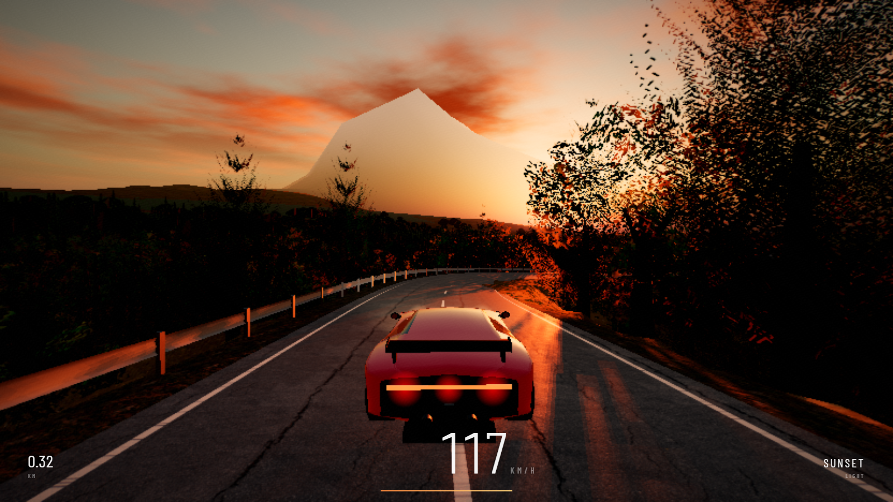
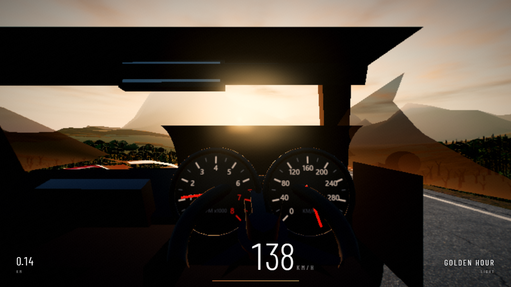
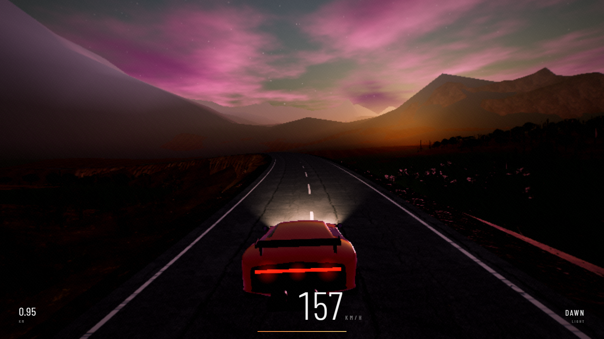

# GOLDEN HOUR

An endless driving game that lives entirely in one HTML file. No build step, no
bundler, no framework.



## What it is

`index.html` is the whole game — around 5,500 lines of HTML, CSS and ES modules,
with Three.js r170 pulled straight from a CDN through an import map. There is
nothing to compile and nothing to install in order to play it. The road, the
terrain, the trees, the sky and the car are all generated in code; the
repository ships no mesh files.

Textures start procedural and stay that way if they have to. Photographic PBR
maps stream in from Poly Haven over the top of them once the scene is already
running, and a failed load is swallowed rather than raised, so the game still
works offline at slightly lower fidelity.

## Running it

```
node serve.mjs        # http://localhost:8099
```

Opening `index.html` off the filesystem does not work, and that is a browser
rule rather than a missing feature: `file://` gives the page an opaque origin, so
the import map, the module graph and the cross-origin texture loads all get
refused. `serve.mjs` is a dependency-free static server of about 25 lines whose
only job is to provide a real HTTP origin — any other static server does just as
well. Pass a port if 8099 is taken: `node serve.mjs 8177`.

Node is needed for that server and for the test suite. The game itself never
touches it.

## Controls

| Key | Action |
| --- | --- |
| `W` / `Up` | Throttle |
| `S` / `Down` | Brake |
| `A` `D` / `Left` `Right` | Steer |
| `Space` | Handbrake |
| `Shift` | Boost |
| `C` | Cycle camera |
| `V` | Cycle frame cap (60 / 120 / uncapped) |
| `R` | Restart |
| `F3` | Debug overlay |

Any key starts the game. Input stays locked for the first second while shaders
compile and the car settles onto its springs.

## What is in it

The road is a pure function of arc-length. Curvature, grade and banking are
sampled from noise, which means the geometry, the physics and the autopilot all
read the same centreline and the world can be generated ahead of the car
indefinitely. Terrain is a separate height field, carved down where it meets the
road and drawn as three LOD rings of tiles that stream in and out around the
player. Vegetation — pines, broadleaf, rocks, grass tufts — is instanced, with a
road proximity field rejecting anything that would otherwise grow through the
tarmac.

Time of day is continuous and drives sun position, sky colour, star visibility
and, as it gets dark, the headlights. Six cameras sit on the `C` key: chase,
wide, close, hood, cockpit and a cinematic orbit. The cockpit is a modelled
interior — speedometer and tachometer needles driven by the car's real speed and
RPM, a rim that tracks steering input, a rear-view mirror, and dials that
self-illuminate at night. Physics runs on a fixed 120 Hz accumulator, so
handling is the same whether the machine renders at 144 fps or 20.



The post chain is god rays, then bloom, then output, then a final colour grade.
Above it sits a quality ladder — `high`, `medium`, `low`, `potato` — that starts
at medium and probes upward only once it has measured real headroom, then walks
back down under load by shedding resolution first, then shadow map size, then
god rays, then world density. Driven at 12x CPU throttling it opens at `potato`
and still renders and steers. Frames are capped at 60 by default.

A few URL fragments override the defaults. `#msaa` opts into multisampling,
which is off by default because the ANGLE/D3D11 resolve black-screens mainstream
NVIDIA setups. `#high`, `#medium`, `#low` and `#potato` pin a tier, and
`#nopost`, `#noshadow` and `#dpr1` strip work out of the frame.

## How it is tested

`assert-drive.mjs` is a permanent regression gate rather than a one-off script.
It drives the car through the game's own fixed-step simulator — setting the same
`KEYS_DOWN` map a real keystroke sets and calling the same `readInput`, so the
input mapping is genuinely under test — and asserts invariants across roughly
15,400 physics steps per run. There are 25 assertions and the process exits
non-zero if any of them fail.

What they hold down: the car can never end up below the sampled ground, checked
once per physics step rather than once per frame, and including while the
quality tiers re-segment the terrain underneath it; steering goes the way the
key says in all six cameras; a 250 ms tap at speed is a lane change rather than
a swerve; alternating flicks, mid-corner braking and full lock at 170 km/h all
fail to spin the car; steering authority falls as speed rises; the car spawns
settled and grounded; dawn is not blown out.

Running those assertions in a headless fixed-step simulation is a deliberate
choice. An earlier version drove with real-time key events under a software
rasteriser, advanced the simulation by 206 steps in a hundred seconds, and every
handling assertion passed trivially because the car had barely moved.

Narrower probes sit alongside it — `dustcheck.mjs`, `weakcheck.mjs`,
`cockpitshot.mjs`, `bloomcheck.mjs`, `foliagecheck.mjs`, `perf.mjs` — which
mostly photograph a fixed state and read values back out of the running page.



## Work in progress

This is an active build and some of it is visibly unfinished. The car model
still reads boxy up close, which the hood and close cameras show off more than
anyone would like. Forest interior lighting is the current focus: the target is
dappled sun on the trail and considerably denser foliage than is here now. Audio
was pulled out and is waiting to go back in.

`PROGRESS.md` is the iteration log and `FEEDBACK.md` is the set of quality and
performance requirements the build is being held against.
